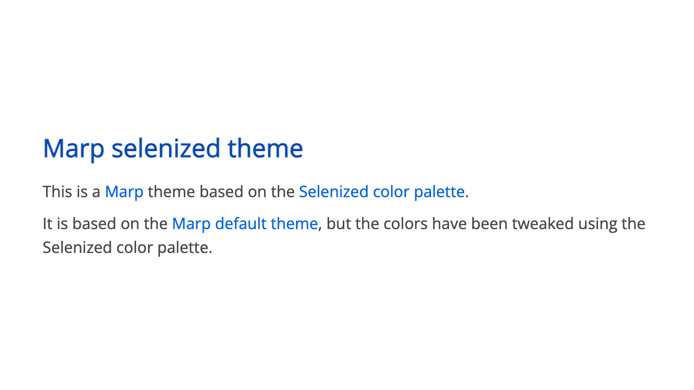
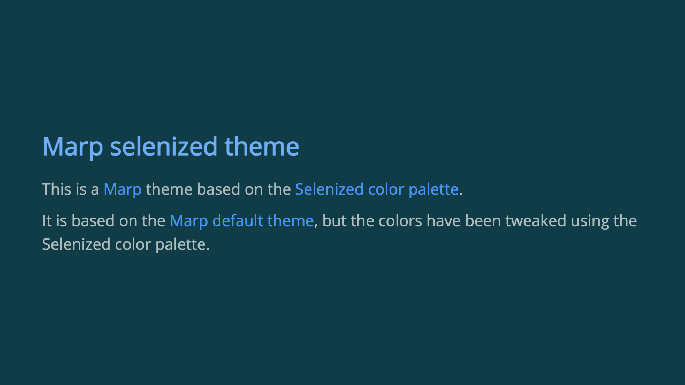
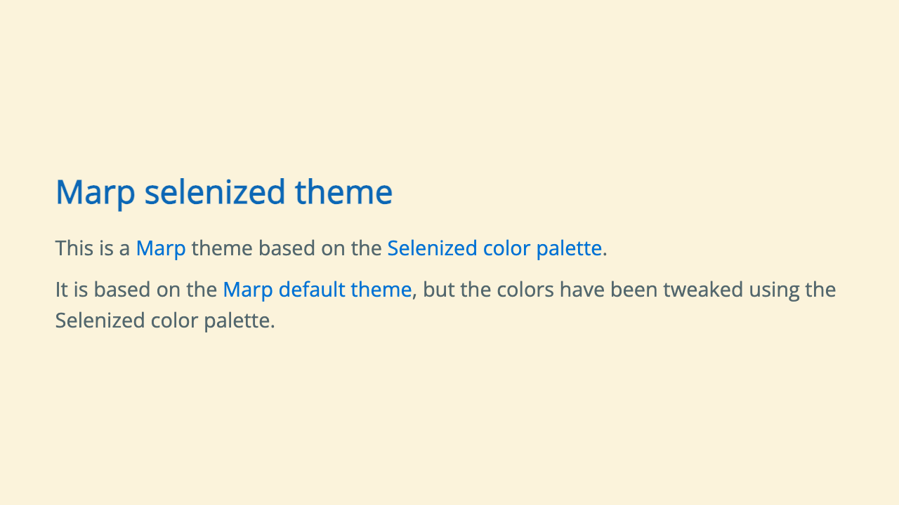

# Marp selenized theme

This is a [Marp](https://marp.app/) theme based on the [Selenized color palette](https://github.com/jan-warchol/selenized).

It is based on the [Marp default theme](https://github.com/marp-team/marp-core/blob/main/themes/README.md#default), but the colors have been tweaked using the Selenized color palette.

## Example

See [example.md](example.md) for an example presentation using this theme.

<style scoped>
td {
    padding: 0;
}
</style>

| default | invert | light |
| --- | --- | --- |
| [](examples/example-default.pdf) | [](examples/example-invert.pdf) | [](examples/example-light.pdf) |

## Installation

For VS Code, edit `.vscode/settings.json` in your workspace and add the following:

```json
{
    "markdown.marp.themes": [
        "https://raw.githubusercontent.com/susumuota/marp-theme-selenized/refs/heads/main/selenized.scss"
    ]
}
```

## Usage

To use this theme, add the following line to the top of your Marp markdown file:

```markdown
---
marp: true
theme: selenized
# class: invert
# class: light
---
```

Uncomment the `class` line to switch between the dark and light variants.

## Customization

To customize the theme, add a `style` block to the markdown file. For example:

```html
<style scoped>
section {
    --h1-color: color-mix(in srgb, var(--color-br-green) 80%, var(--color-fg-1) 20%);
    --heading-strong-color: var(--color-green);
    --header-footer-color: var(--color-dim-0);
    --paginate-color: var(--color-dim-0);

    --link-color: var(--color-red);
    --mark-color: var(--color-yellow);
    --table-color: var(--color-green);
}
</style>
```

The default colors are defined in the [selenized.scss](selenized.scss) file.

## Tips

I usually use the `invert` class when editing the markdown to protect my eyes. Then I switch back to the default theme before exporting to PDF.

## License

This theme is licensed under the [MIT License](LICENSE).
